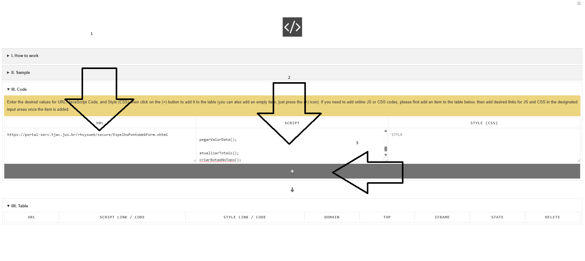
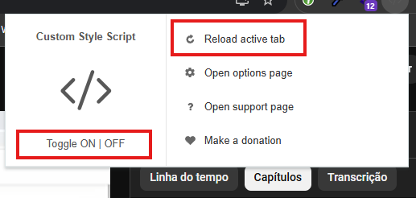
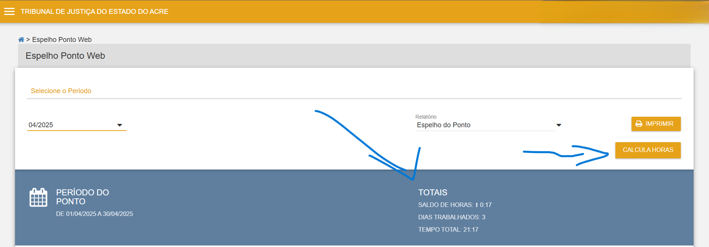

# Como utilizar este script

- Instale a extensão **Custom Style Script** no navegador chrome, veja o [**vídeo**](https://www.youtube.com/watch?v=P5vJcBgVzPA)
- Copie o script em formato raw [link](https://git.tjac.jus.br/maicon.araujo/claculadora-de-horas/-/raw/develop/calculadora-de-horas.js?ref_type=heads)
- Cole no local indicado:
- 
- 

## Resultado

- Na página do espelho de ponto você verá as métricas conforme imagem abaixo:

> Não funciona na extensão do firefox